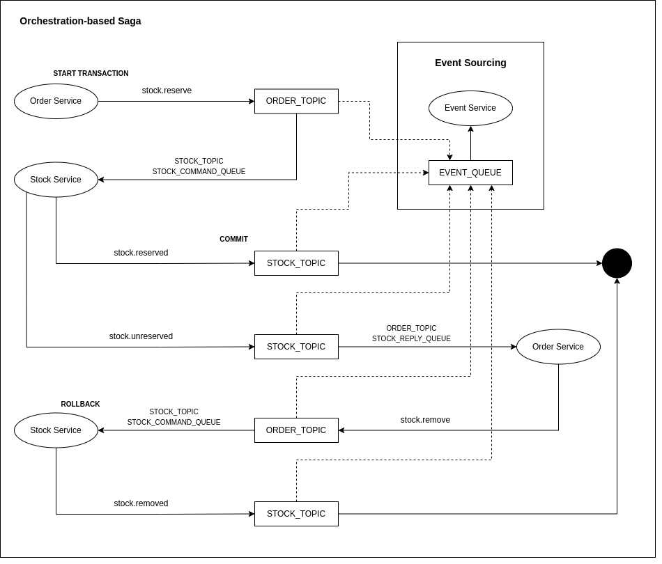
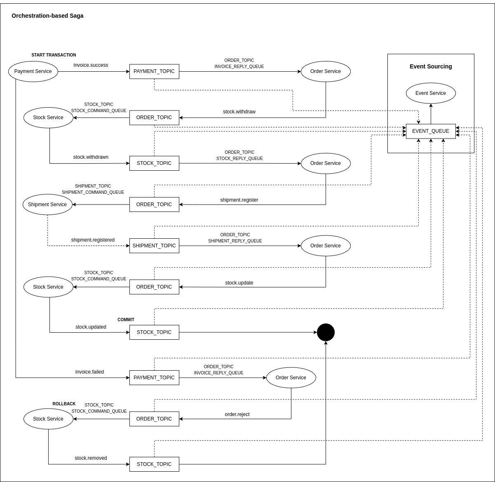

# Orchestration-based Saga Pattern

Proof of concept for Orchestration-based saga in NodeJS.

## Reference docs

- [Saga Pattern](https://microservices.io/patterns/data/saga.html)
- [Event Sourcing](https://microservices.io/patterns/data/event-sourcing.html)

## Install

```ssh
# Start docker containers
docker-compose up -d

# Start all
npm start
```

## Tools

- [Order Service - Mongo Express](http://localhost:8081/);
- [Payment Service - Mongo Express](http://localhost:8082/);
- [Shipment Service - Mongo Express](http://localhost:8083/);
- [Stock Service - Mongo Express](http://localhost:8084/);
- [Event Service - Mongo Express](http://localhost:8085/);

## Endpoints and models

- POST http://localhost:3000/orders - Create pending order.

```json
{
	"items": [
		{
			"productId": "620953c6c4037f2c34607436", 
			"quantity": 4
		}
	]
}
```



- POST http://localhost:3001/payments - Make payment.

```json
{
	"orderId": "620953de53143ff095a8c09f", 
	"customerId": "620953c696a6bab50ef85f8b"
}
```

